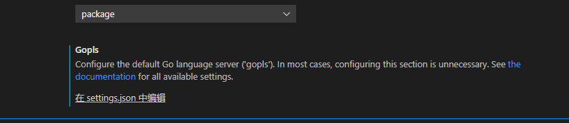

## 引言

gopls 在0.7版本之前不存在此问题，0.7之后，gopls 在go.mod 不在当前目录下的情况下，会报错，提示找不到 go.mod 文件。

## gopls设置

参考gopls 文档： <https://github.com/golang/tools/blob/master/gopls/doc/settings.md>

### 报错的原因

experimentalWorkspaceModule bool

This setting is experimental and may be deleted.
experimentalWorkspaceModule opts a user into the experimental support for multi-module workspaces.

Default: false.

## vscode 中设置

在插件设置最底下


```json
{
    "gopls": {
        "experimentalWorkspaceModule": true
    }
}
```

解决报错
